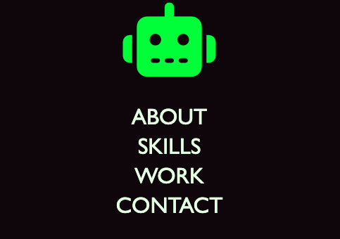
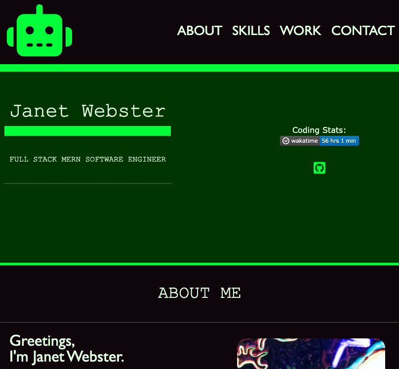

# JANET WEBSTER'S PORTFOLIO

## Project Process:

### Action Plan
1. Create and deploy portfolio that demonstrates work and skills
2. Include name, title, photo, personal highlights, skills, work, and contact information
3. Activate navigation links to scroll users to sections on page
4. Work projects direct the user to engage with their live sites
5. The first work project is emphasized by being the largest
6. Site is responsive for various screen sizes
7. Code is reviewed by accessibility tools: https://wave.webaim.org/

### HTML
Initiated the project by framing out the HTML with the content that I knew I wanted to include in the project
* Updated HTML as needed during testing of CSS and responsiveness
* Used semantic elements as much as possible
* Potential option for refactoring to make some DIV elements surrounding elements I would like to have flex/flow better

### CSS
I had a rough idea of how I wanted to engage my selectors based off of previously building a portfolio.
* Started from top to bottom in terms of how the HTML flows
* Created :root variants to have base colors and fonts to call upon
* Styled the website from a mobile-focus first, then added media queries to set min-width for tablet and desktop
* Point of struggle was getting the .work elements to function how I want them to

### Delivery
1. Website Deployed: https://twixmixyjanet.github.io/janet-webster-portfolio/
2. Critical details included 

3. Active navigation applied 

4. Work projects linked 

5. First project is emphasized 

6. Site is responsive 

7. Code reviewed 
