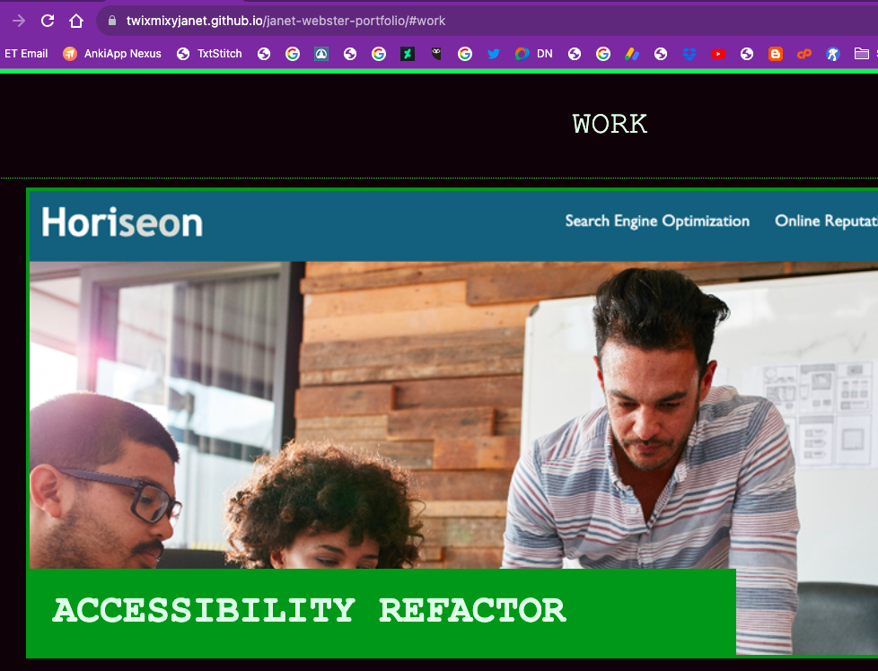
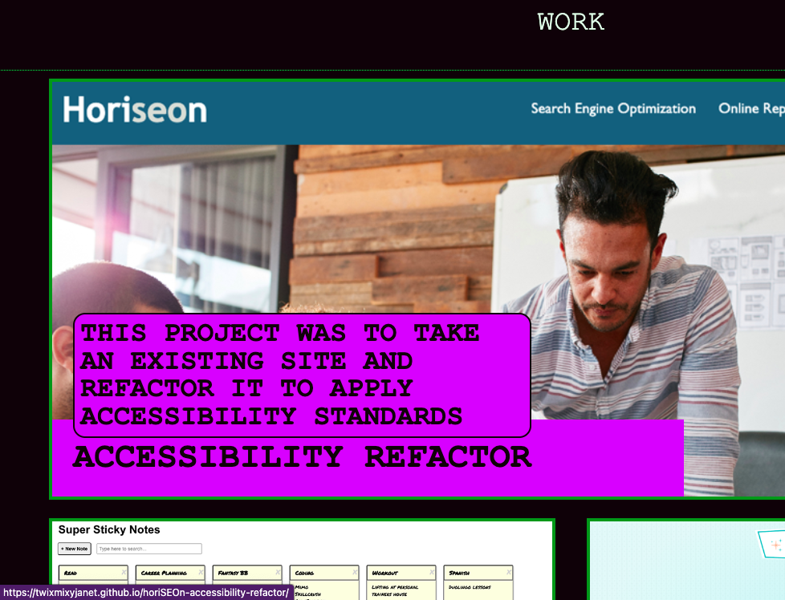
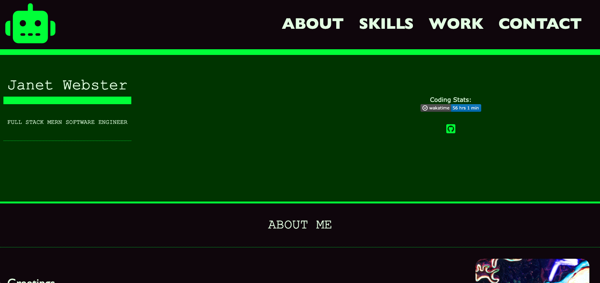

# JANET WEBSTER'S PORTFOLIO
[View Project Here](https://twixmixyjanet.github.io/janet-webster-portfolio/ "Janet Webster's Portfolio") 

| Technology Used    | Resource URL |
| --------  | ------- |
| HTML      | https://developer.mozilla.org/en-US/docs/Web/HTML |
| CSS       | https://developer.mozilla.org/en-US/docs/Web/CSS |
| Git       | https://git-scm.com/ |
| VSCode    | https://code.visualstudio.com/ |

## Table of Contents

* [Description](#description)
* [Installation](#installation)
* [Usage](#usage)
* [Credits](#credits)
* [License](#license)

## Description:

### Action Plan
1. Create and deploy portfolio that demonstrates work and skills
2. Include name, title, photo, personal highlights, skills, work, and contact information
3. Activate navigation links to scroll users to sections on page
4. Work projects direct the user to engage with their live sites
5. The first work project is emphasized by being the largest
6. Site is responsive for various screen sizes
7. Code is reviewed by accessibility tools: https://wave.webaim.org/

### HTML
Initiated the project by framing out the HTML with the content that I knew I wanted to include in the project
* Updated HTML as needed during testing of CSS and responsiveness
* Used semantic elements as much as possible
* Potential option for refactoring to make some DIV elements surrounding elements I would like to have flex/flow better

### CSS
I had a rough idea of how I wanted to engage my selectors based off of previously building a portfolio.
* Started from top to bottom in terms of how the HTML flows
* Created :root variants to have base colors and fonts to call upon
* Styled the website from a mobile-focus first, then added media queries to set min-width for tablet and desktop
* Point of struggle was getting the .work elements to function how I want them to

### Delivery
1. Website Deployed: https://twixmixyjanet.github.io/janet-webster-portfolio/
2. Critical details included 

3. Active navigation applied 

4. Work projects linked 

5. First project is emphasized 

6. Site is responsive 

7. Code reviewed 

## Installation

1. Create a new repository on GitHub, to store this project.
2. Clone the repository to your computer.
3. Copy files to your own repository.
4. Make changes to the code.
5. Commit the changes to the local repo.
6. Push the changes to the remote repo.

## Usage

This one page website portfolio can be used as a base template. Simply swap out information, work, skills, and contact you may need for it to match your requirements.

## License

MIT License
Copyright (c) 2023 Twixmixy / Janet Webster

## About The Author
### Janet Webster
Full Stack MERN Software Engineer in training.

- [GitHub](https://github.com/TwixmixyJanet/)
- [LinkedIn](https://www.linkedin.com/in/twixmixy/)
- [Twitter](https://twitter.com/Twixmixy)
- [WakaTime](https://wakatime.com/@Twixmixy)

